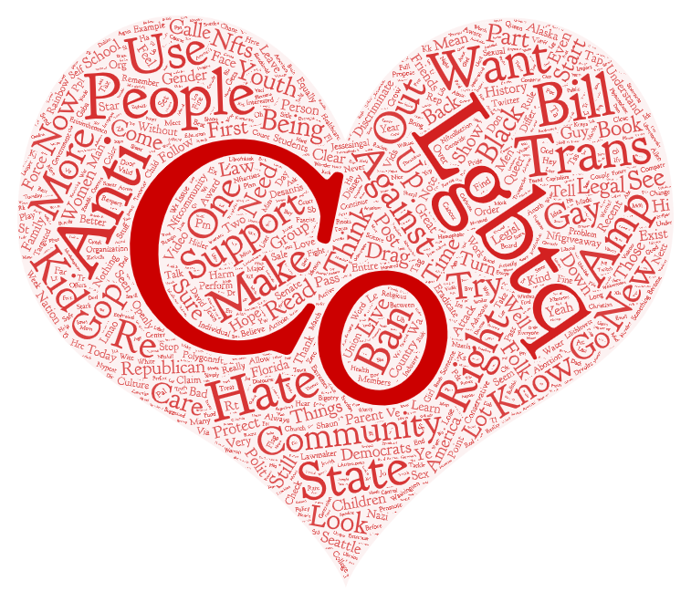
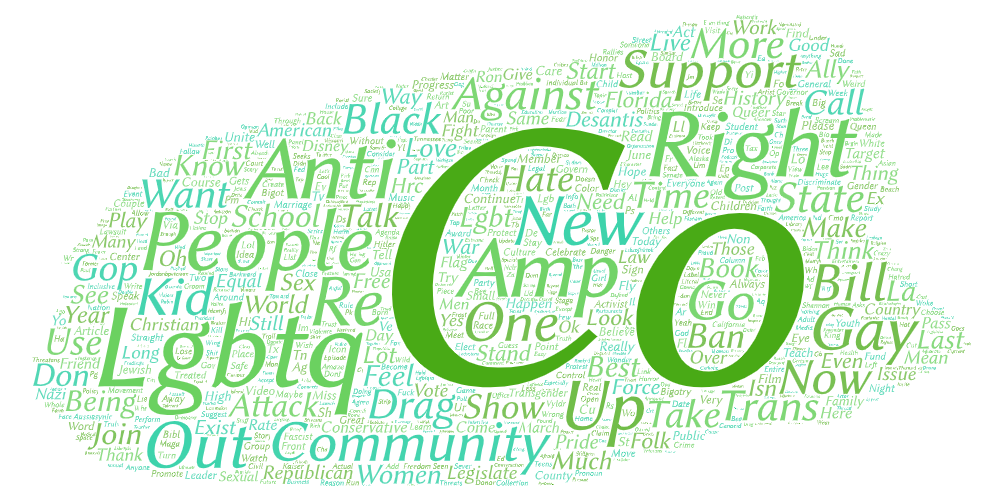
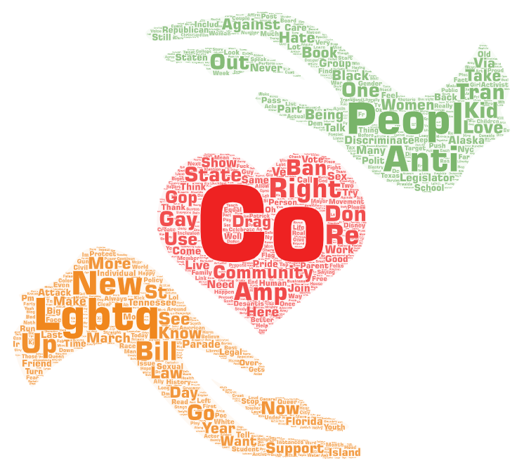

# LGBTQcloud

**Author**: Yi-Yang Su

## Introduction:

This project practices searching keyword information form twitter API on google colab codes. The topic I desided is LGBTQ since it is a huge social issue been talked by people. I set the time started from 2018 since it was the time I learned the word while entering the university, and the three locations to do the resrarch on are Seattle, Los Angeles, and New York City,three largest cities in the United States, since I want to know how people in different cities relates to this topic.

## Settings for parameters:

 - keyword: "LGBTQ"
 - time start: "2018-1-1"
 - Locations: SEATTLE, LOS ANGELES, NEW YORK CITY
 - Radious: 15, 20, 10 mi
   

## Word Cloud 1: Seattle Area

[research data csv file](https://github.com/ivansu1999/LGBTQcloud/blob/main/assets/twsearch-resultSEA.csv)

## Word Cloud 2: Los Angels Area

[research data csv file]([asset/twsearch-resultLA.csv](https://github.com/ivansu1999/LGBTQcloud/blob/main/assets/twsearch-resultLA.csv))

## Word Cloud 3: New York Area

[research data csv file](https://github.com/ivansu1999/LGBTQcloud/blob/main/assets/twsearch-resultNY.csv)

## Conclusion:

All the three result graphs are similar to my expectation before staring this project. They are the largest cities in the United States where people all around the world are tarveling to. Thoughts of people's freedom and personal right will be more improved than other local cities. We could see words like Anti, CO, community, new, against, and hate showing in all three word clouds. It is because people from the cities are protesting for vulnerable groups and to tell the world about people's right of freedom.

My reserach word cloud could be improved by having more datasets from different cities or towns. Since the three cities I choose to work on are all large cities which people in all the world travels a lot. People's thoughts will be more advanced. It could be bias and requires more informaiton from other places to learn which part of the United States should improve their thoughts toward LGBTQ.

## Resourse:
 - [Twitter Developer](https://developer.twitter.com/en)
 - [Google Colab](https://colab.research.google.com/github/jakobzhao/geog458/blob/master/labs/lab02/twsearch.ipynb#scrollTo=GMywhiuFoobU)
 - [Word Art](https://wordart.com/)
